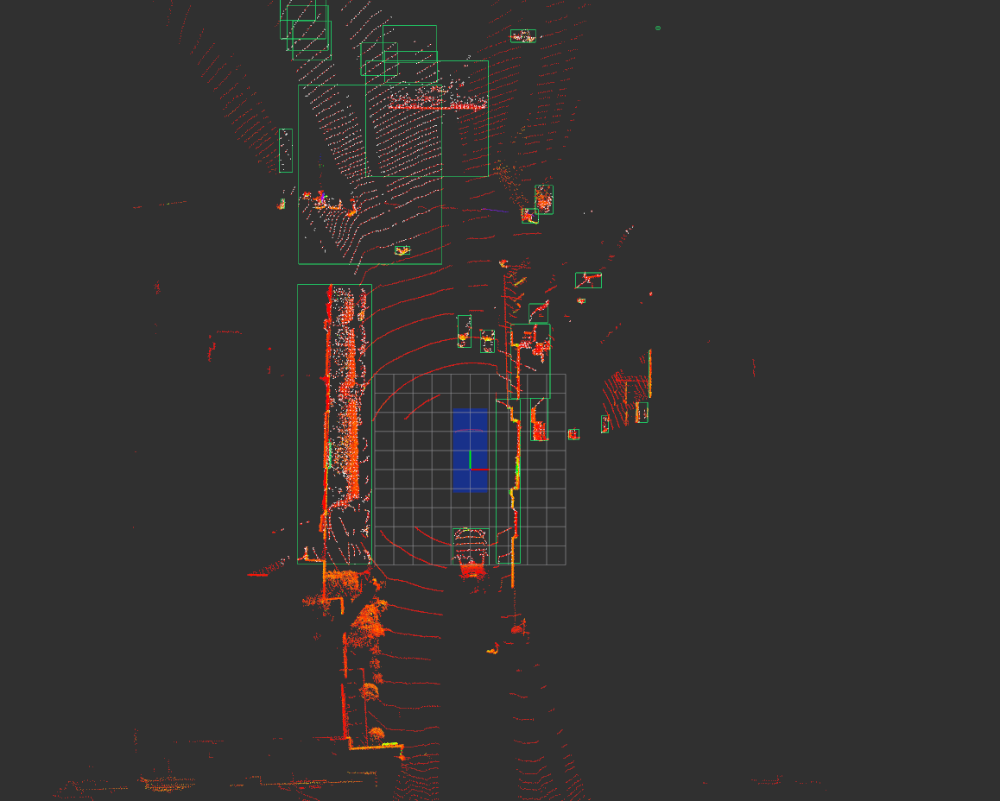

# lidar_cluster_detection
Using Euclidean Clustering to detect 3D LiDAR Object.


## How to use
1. Prepare your LiDAR dataset
2. Download the repository
3. Compile
4. Execute

## Installation
```bash
# clone the repo
git clone https://github.com/JEFFCHANG0501/lidar_cluster_detection.git

# build
cd lidar_cluster_detection
colcon build
source install/setup.bash
```

## Usage
```bash
# publish your LiDAR dataset with PointCloud 
ros2 launch pcd_publisher pcd_publisher_node.launch.py

# Execute euclidean_clustering_node
ros2 run lidar_euclidean_clustering  euclidean_clustering_node
```

